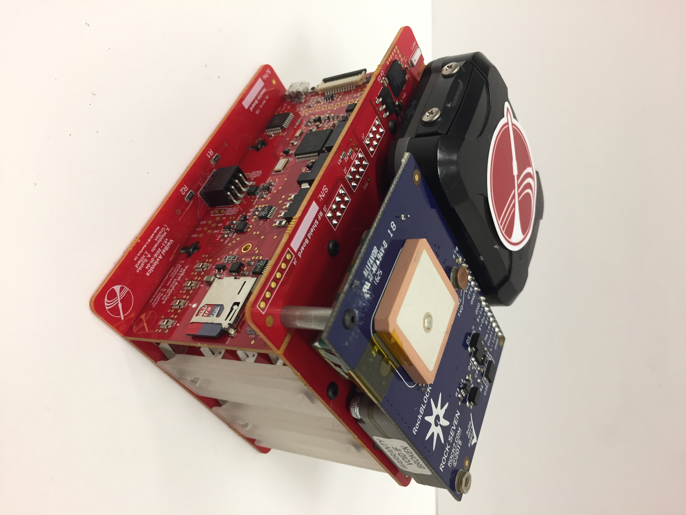

# SSI VALBAL:
### Low Cost, High Endurance, Altitude-Controlled Latex Balloon for Near-Space Research

# Flight States:
The avionics uses an Event Driven Programming model in order to clearly transition between states of operation.

#### States
1. Pre-Launch  
 - 1a. Startup initialization
 - 1b. Debug Mode
2. Launch
 - 2a. Flight Mode
 - 2b. Equilibration
3. Termination
 - 3a. Descent
 - 3b. Hibernation
 - 3c. Recovery

# Code Architecture:
The avionics flight software operates on a read-eval loop in order to change states and respond to its environment.

The avionics flight software was written in compliance with NASA JPL's  Safety-Critical Code standards.

#### Files
`main.cpp` - Start point of flight controller.

`config.h` - Mission specific configuration values.

`data.h` - Structure of current data frame.

#### Classes
`Avionics` - Implementation of flight logic.

`Controller` - Interface to feedback control algorithm.

`Sensors` - Interface to raw data from hardware.

`Filters` - Interface to corrected data from filters.

`Actuators` - Interface to valve and ballast mechatronics.

`Charger` - Interface to superCap charging circuit.

`Hardware` - Interface to PCB hardware.

`Logger` - Interface to compressed SD card stream.

`Payload` - Interface to external research payloads.

`Simulator` - Client side code for Hardware in the Loop simulations.

#### Libraries
`GPS` - Wrapper library for GPS with added features.

`RockBLOCK` - Wrapper library for RockBLOCK with added features.

`AD5246` - Library for i2c Resistor.

#### Utilities
`Parser` - De-parser of compressed flight telemetry.

`readsd` - De-parser of compressed SD card stream.

# Implementation Details:
Here is the current status of the code:

#### Flight Critical Systems
1. MicroSD logging of current data frame to LOGGERXX.txt.
2. Altitude readings from filtered and error checked BMP280s.
3. Feedback control algorithm to equilibrate at altitude.
4. Custom charging circuit feedback control.
5. Valve mechanical actuation.
6. Ballast mechanical actuation
7. Integration of uBlox M8Q GPS.
8. RockBlock data downlink.
9. 1Hz LED in compliance with FAA.
10. Payload interface for communicating with research payloads.

#### Useful Flight Features
1. Ascent rate calculations from filtered and error checked data.
2. External temperature readings.
3. Subsystem current readings.
4. Subsystem shutdown if failure to restart.
5. Low power mode for ARM Cortex M4.
6. GPS successful set to flight mode.
8. Compression of data frame into bitstream for comms.
9. RockBlock command parsing for satcomms uplink.
11. Manual control of flight Parameters.
12. Debug mode disabled at altitude.
13. Stable loop rate regulation.
13. HITL simulations testing suite.
