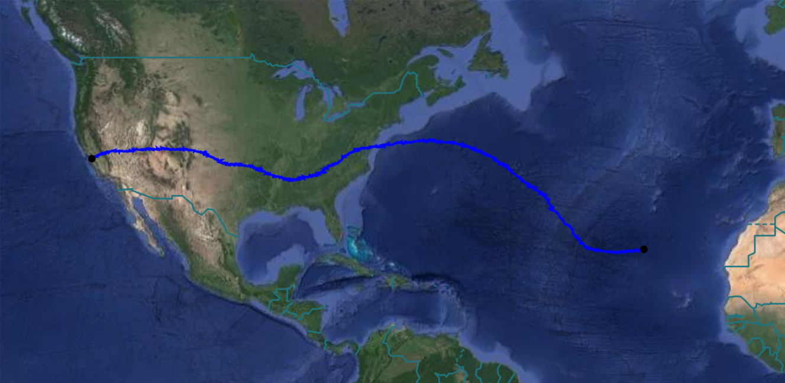

# SSI VALBAL:
### SSI's World-Record Breaking Low Cost, High Endurance, Altitude-Controlled Latex Balloon for Near-Space Research

# Code Architecture:
The avionics flight software operates on a read-eval loop in order to change states and respond to its environment.

The avionics flight software was written in compliance with NASA JPL's  Safety-Critical Code standards.

#### Files
`main.cpp` - Start point of flight controller.

`config.h` - Mission specific configuration values.

`data.h` - Structure of current data frame.

#### Classes
`Avionics` - Implementation of flight logic.

`Controller` - Interface to feedback control algorithm.

`Sensors` - Interface to raw data from hardware.

`Filters` - Interface to corrected data from filters.

`Actuators` - Interface to valve and ballast mechatronics.

`Charger` - Interface to superCap charging circuit.

`Hardware` - Interface to PCB hardware.

`Logger` - Interface to compressed SD card stream.

`Payload` - Interface to external research payloads.

`Simulator` - Client side code for Hardware in the Loop simulations.

#### Libraries
`GPS` - Wrapper library for GPS with added features.

`RockBLOCK` - Wrapper library for RockBLOCK with added features.

`AD5246` - Library for i2c Resistor.

#### Utilities
`Parser` - De-parser of compressed flight telemetry.

`readsd` - De-parser of compressed SD card stream.

# Implementation Details:
Here is the current status of the code:

#### Flight Critical Systems
1. Altitude readings from filtered and error checked BMP280s
2. Feedback control algorithm for equilibration at altitude
3. Custom charging circuit feedback control
4. Valve mechanical actuation and de-jamming
5. Ballast mechanical actuation and de-jamming
6. MicroSD logging of current data frame
7. Integration of uBlox M8Q GPS
8. Satellite data downlink over RockBlock
9. 1Hz LED in compliance with FAA
10. Payload interface for communicating with research payloads

#### Useful Flight Features
1. Ascent rate calculations from Kalman filtered data
2. External temperature readings
3. Subsystem current readings
4. Subsystem shutdown if reboot failure
5. Low power mode for ARM Cortex M4 processor
6. GPS set to flight mode
7. Compression of data frame into bitstream for comms
8. Satellite uplink command parsing over RockBlock
9. Manual control of flight parameters over satellite uplink
10. Stable loop rate regulation
11. Extended debug mode
12. HITL & modular simulations testing suite